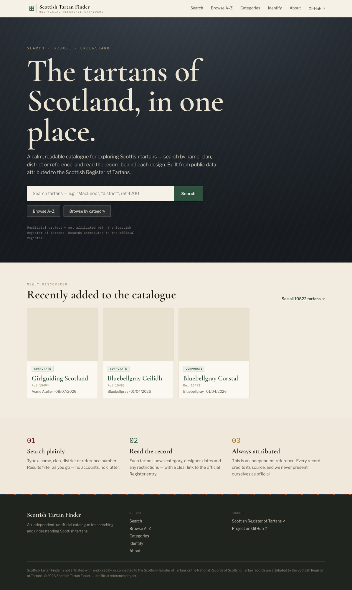
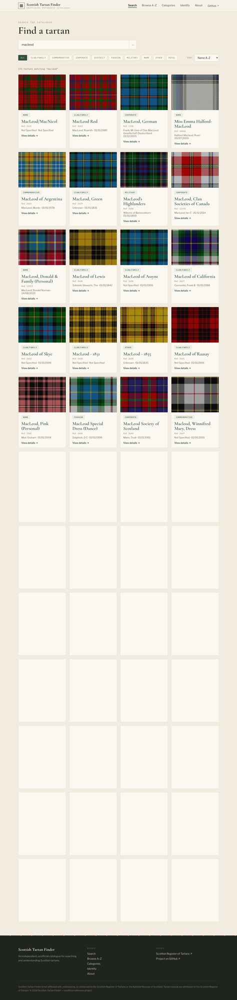
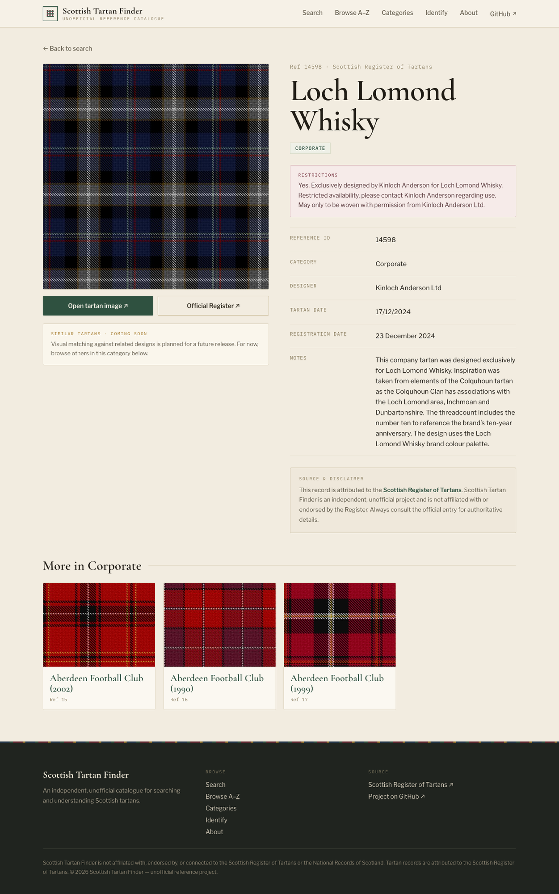
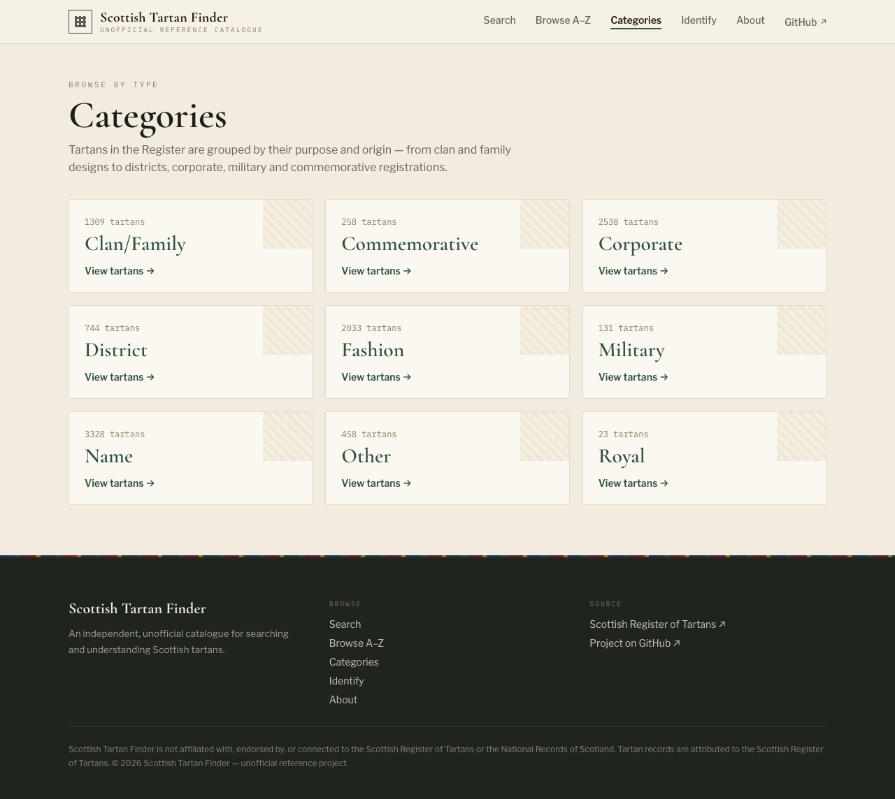
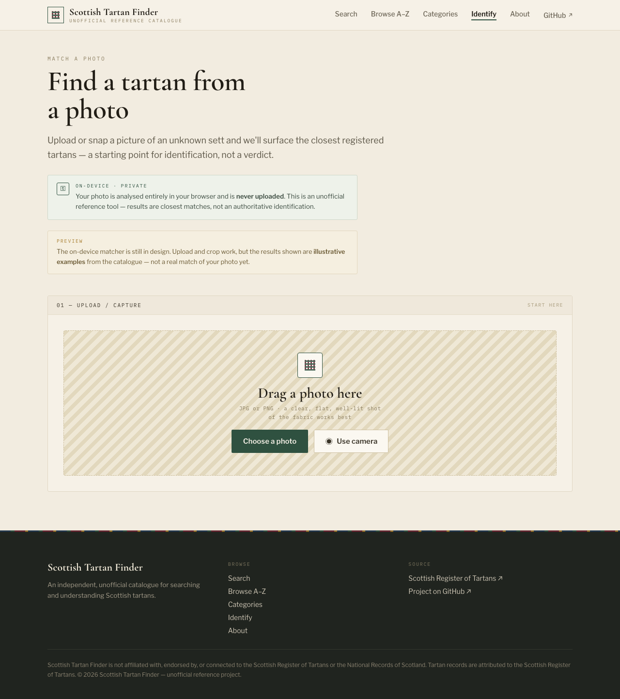

# Scottish Tartan Finder

A calm, fast, static catalogue for searching and browsing **every tartan in the Scottish Register of Tartans** — 10,822 records, no accounts, no clutter. Search by name, clan, district, designer, notes or reference, and read the record behind each design.

**Live:** <https://mike623.github.io/scottish-tartan-finder/>



> [!NOTE]
> This is an independent, **unofficial** project. It is not affiliated with, endorsed by, or connected to the Scottish Register of Tartans or the National Records of Scotland. Every record links back to the authoritative Register entry.

## Features

- **Full catalogue** — all 10,822 public tartans, each with its own static page (metadata, restrictions, official image, source link).
- **Fuzzy search** — typo-tolerant, relevance-ranked (Fuse.js) over name, designer, category and registration notes. Runs entirely in your browser.
- **Fast at scale** — search and browse render client-side from a compact index with infinite scroll, so the pages stay ~24 KB instead of 16 MB.
- **Browse A–Z and by category**, with quick letter navigation.
- **Identify from a photo** — an on-device (privacy-preserving) photo-match page. The matcher itself is still in design; the flow is a preview.
- **Self-updating** — a scheduled crawler picks up newly registered tartans and redeploys automatically.

## Screenshots

| Fuzzy search | Tartan detail |
| :---: | :---: |
| [](https://mike623.github.io/scottish-tartan-finder/search/) | [](https://mike623.github.io/scottish-tartan-finder/tartan/14598/) |
| **Browse by category** | **Identify from a photo** |
| [](https://mike623.github.io/scottish-tartan-finder/categories/) | [](https://mike623.github.io/scottish-tartan-finder/identify/) |

## How it works

Two workspaces, one dataset:

```
Scottish Register  ──►  packages/scraper  ──►  data/tartans-index.json  ──►  apps/web (Astro)  ──►  GitHub Pages
   (public pages)        polite crawler          the shared contract         static site + client search
```

- **The scraper** discovers tartan reference IDs from the Register's public A–Z pages and "What's New" feed (never brute-forcing numeric IDs), fetches each detail page, and parses it into a structured record. It writes `data/tartans-index.json`.
- **The web app** reads that JSON at build time to generate a static page per tartan, plus a compact index the browser uses for search and browse.
- **CI** rebuilds and deploys to GitHub Pages on every push to `main`; a weekly workflow runs an incremental crawl, commits any new tartans, and redeploys.

See [`docs/data-schema.md`](docs/data-schema.md) for the record shape and [`docs/source-investigation.md`](docs/source-investigation.md) for the live-site findings and crawl-safety decisions.

## Tech stack

- **[Astro](https://astro.build)** — static site generation
- **TypeScript** throughout
- **[Fuse.js](https://fusejs.io)** — client-side fuzzy search
- **[Cheerio](https://cheerio.js.org)** — HTML parsing in the scraper
- **`node:test`** — scraper unit tests
- **GitHub Actions + Pages** — build, crawl, deploy

## Project structure

```
apps/web/            Astro site (pages, layout, components)
packages/scraper/    TypeScript crawler (discovery, detail parser, incremental sync)
data/tartans-index.json   Generated catalogue — the scraper↔web contract
docs/                PRD, data schema, source investigation, design specs
.github/workflows/   deploy.yml (Pages) · crawl.yml (weekly incremental crawl)
```

## Getting started

> [!NOTE]
> Requires Node.js 24+.

```bash
git clone https://github.com/mike623/scottish-tartan-finder.git
cd scottish-tartan-finder
npm install
npm run dev
```

Then open the printed local URL (served under the `/scottish-tartan-finder` base path).

### Commands

Run from the repo root — scripts delegate into the workspaces:

```bash
npm run dev        # start the Astro dev server
npm run build      # type-check + build the static site to apps/web/dist
npm run preview    # serve the built site
npm test           # run the scraper's unit tests

# Crawler (polite: 1 request at a time, 2s spacing, retries with backoff)
npm run crawl:sync -- --mode whatsNew --max 25   # incremental: fetch newly registered tartans
npm run crawl:sync -- --mode az --max 500        # backfill from the A–Z index
npm run crawl:smoke                              # tiny end-to-end sample run
```

The crawler is incremental and resumable: it diffs discovered references against the local index and only fetches what's new, upserting by reference with atomic writes.

## Data, attribution & licensing

Tartan records are attributed to the **Scottish Register of Tartans**, maintained by the National Records of Scotland.

> [!IMPORTANT]
> The Register's material is **Crown copyright**. Text may be re-used in any format with attribution. **Images** are licensed only for *fair dealing* purposes, so this project **links to** the official images rather than mirroring them, and database rights in the Register rest with the Crown. Any redistribution, self-hosting of images, or commercial use must be reviewed against the [Register's terms](https://www.tartanregister.gov.uk/copyright) first.

The crawler is deliberately conservative — a descriptive User-Agent, single-request concurrency, rate limiting, backoff, and discovery via the Register's own public indexes (no brute-force enumeration).

## Roadmap

- **Photo → tartan matching** — a fully in-browser image search (embedding recall + structural re-rank). Designed but not yet built; see [`docs/superpowers/specs/2026-07-16-image-search-design.md`](docs/superpowers/specs/2026-07-16-image-search-design.md).
- **Image caching proxy** — optional on-demand edge cache to speed up the Register's on-the-fly image rendering.
